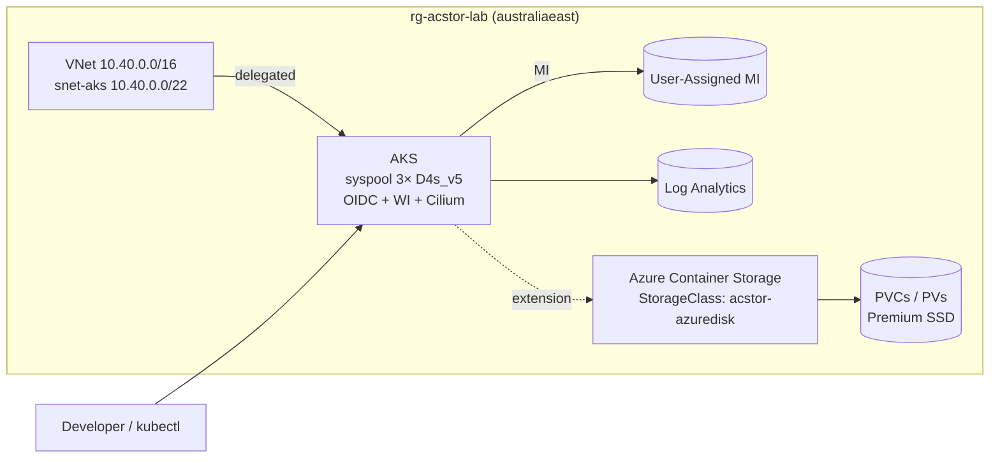

# aksstorage — Azure Container Storage lab on AKS

A small, opinionated lab for **Azure Container Storage (ACStor)** running on
AKS in Australia East. Bicep-only IaC, no keys (managed identity + workload
identity), and a deliberate set of failure scenarios to exercise the storage
layer.

## What's in here

```
infra/         Bicep — AKS, VNet, Log Analytics, MI, role assignments
manifests/     Storage pools + sample stateful workload (Postgres + smoke pod)
chaos/         NetworkPolicy + disk-filler for failure-scenario exercises
docs/          LAB.md (step-by-step) and FAILURE-SCENARIOS.md
tests/         validate.sh + fio.yaml
```

## Architecture



## Quickstart

```bash
RG=rg-acstor-lab
az group create -n "$RG" -l australiaeast
cp infra/main.parameters.example.json infra/main.parameters.json
az deployment group create -g "$RG" -f infra/main.bicep -p @infra/main.parameters.json
az aks get-credentials -g "$RG" -n $(az aks list -g "$RG" --query '[0].name' -o tsv) --overwrite-existing
az aks update -g "$RG" -n $(az aks list -g "$RG" --query '[0].name' -o tsv) \
  --enable-azure-container-storage azureDisk \
  --azure-container-storage-nodepools syspool
kubectl apply -f manifests/
./tests/validate.sh
```

Full walkthrough → [`docs/LAB.md`](docs/LAB.md)
Breaking things → [`docs/FAILURE-SCENARIOS.md`](docs/FAILURE-SCENARIOS.md)

## Cost estimate

Rough day-rate, Australia East, list price:

| Component                       | $/day (USD) |
|---------------------------------|-------------|
| 3× Standard_D4s_v5              | ~$14        |
| Azure Container Storage (per-GiB) | ~$1 per 100 GiB pool |
| Premium SSD (PVCs, 30 GiB total)| ~$0.50      |
| Log Analytics (light ingest)    | ~$1         |
| Load balancer (standard)        | ~$0.60      |
| **Total** (idle)                | **~$17 / day** |

Tear it down when you're done:

```bash
az group delete -n rg-acstor-lab --yes --no-wait
```

## Security posture

- **No local admin accounts** on AKS — `disableLocalAccounts: true`
- **No keys** — user-assigned MI + kubelet MI; workload identity / OIDC issuer enabled
- **No secrets in repo** — `*.parameters.json` is gitignored; only the `.example` ships
- **Cilium dataplane + Azure CNI** — NetworkPolicy works out of the box

## Status


## License

MIT — see [LICENSE](LICENSE).
