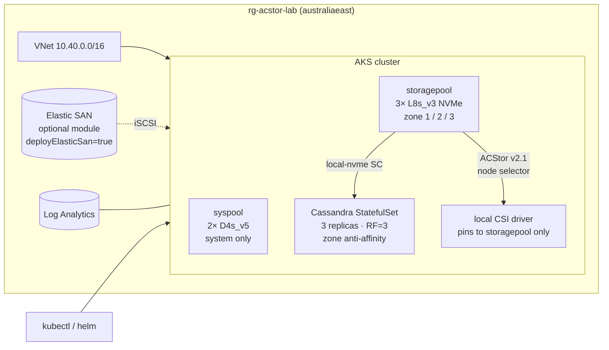

# aksstorage — Azure Container Storage **v2.1** on AKS

**Cassandra on local NVMe** as primary workload · **Elastic SAN** optional · **Azure Disk** & **Azure Files** via built-in CSI

[](infra/)
[](docs/LAB.md)
[](https://blog.aks.azure.com/2026/04/08/acstor-v2.1-ga)

---

## What's new in v2.1

- **Modular on-demand install** — deploy only the CSI driver your chosen storage type needs. Two flows: enable + type upfront (Flow A) or enable-only then add type later (Flow B). No more monolithic install.
- **Elastic SAN integration** — iSCSI-backed storage bypasses VM disk-attach limits. Consolidate hundreds of PVs under a single SAN. Optional module in this repo.
- **Node selector / component placement** — `storageoperator.acstor.io/nodeAffinity` annotation on StorageClass pins local CSI drivers to the `storagepool` node pool only. No DaemonSet sprawl onto system nodes.

→ [v2.1 GA blog post](https://blog.aks.azure.com/2026/04/08/acstor-v2.1-ga)

---

## Architecture



---

## What's in here

```
infra/               Bicep — AKS (syspool + storagepool), VNet, Log Analytics
  modules/
    aks.bicep          Two node pools: syspool (D4s) + storagepool (L8s_v3 NVMe)
    elasticsan.bicep   Optional ESAN module + RBAC (deployElasticSan=false)
    network.bicep
    monitoring.bicep
manifests/
  storageclass/        local-nvme · azure-disk · elastic-san · azure-files StorageClasses
  workloads/           Cassandra STS + loadgen · Postgres · nginx-shared (RWX) · smoke-writer
chaos/                 NetworkPolicy + disk-filler
docs/
  LAB.md               Full step-by-step (Cassandra NVMe primary path)
  K9S.md               k9s terminal UI — install + lab cheatsheet
  STORAGE-ARCHITECTURE.md  Mental model — ephemeral vs persistent, replication ownership, CSI comparison
  SCENARIOS.md         Picker matrix — ACS-managed (NVMe, ESAN) vs built-in CSI (Disk, Files)
  ELASTIC-SAN.md       ESAN bring-up + multi-PV demo
  PREMIUM-SSD-V2.md    Premium SSD v2 — independent IOPS dial + Postgres demo (single-instance DBs)
  FAILURE-SCENARIOS.md Cassandra + NVMe specific failure exercises
  AZURE-FILES.md       Azure Files (SMB + NFS) RWX walkthrough + nginx-shared demo
  COST-CLEANUP.md      Per-scenario cost shape + teardown playbook
tests/
  validate.sh          Checks acstor pods, SCs, Cassandra nodetool + CQL
  fio-nvme.yaml        Raw NVMe throughput + IOPS baseline
  fio.yaml             (legacy — generic dd smoke test)
```

---

## Pick your storage

ACS v2.1 only manages **two** storage types: `ephemeralDisk` (local NVMe) and
`elasticSan`. Disk-backed and file-backed PVs use the **AKS built-in CSI
drivers** that ship with every cluster — included here for side-by-side
comparison.

| Storage type | StorageClass | Managed by | Best for |
|---|---|---|---|
| Local NVMe (primary) | `local-nvme` | **ACS v2.1** (`ephemeralDisk`) | Cassandra, Redis, Kafka — app-level replication |
| Elastic SAN (optional) | `azuresan-csi` | **ACS v2.1** (`elasticSan`) | DBaaS / 100s of PVs, bypass disk-attach limits |
| Azure Disk | `azure-disk` | AKS built-in CSI (`disk.csi.azure.com`) | Postgres — durable, reattachable block |
| Premium SSD v2 | `premium-ssd-v2` | AKS built-in CSI (`disk.csi.azure.com`, modern SKU) | Single-instance DBs needing sub-ms + durability → [`docs/PREMIUM-SSD-V2.md`](docs/PREMIUM-SSD-V2.md) |
| Azure Files | `acstor-azurefiles-{standard,premium,nfs}` | AKS built-in CSI (`file.csi.azure.com`) | RWX / SMB / NFS — shared content, web farms, CI caches → [`docs/AZURE-FILES.md`](docs/AZURE-FILES.md) |

→ Full matrix: [`docs/SCENARIOS.md`](docs/SCENARIOS.md)
→ Concepts/why: [`docs/STORAGE-ARCHITECTURE.md`](docs/STORAGE-ARCHITECTURE.md)

---

## Quickstart — Cassandra on NVMe (Flow A)

```bash
RG=rg-acstor-lab
az group create -n "$RG" -l australiaeast

cp infra/main.parameters.example.json infra/main.parameters.json
az deployment group create -g "$RG" -f infra/main.bicep -p @infra/main.parameters.json

CLUSTER=$(az aks list -g "$RG" --query '[0].name' -o tsv)
az aks get-credentials -g "$RG" -n "$CLUSTER" --overwrite-existing

# v2.1 Flow A — enable + ephemeralDisk upfront
az aks update -g "$RG" -n "$CLUSTER" \
  --enable-azure-container-storage ephemeralDisk \
  --storage-pool-option NVMe \
  --azure-container-storage-nodepools storagepool

kubectl apply -f manifests/storageclass/local-nvme.yaml

# Helm (Bitnami Cassandra)
helm install cassandra --namespace cassandra --create-namespace \
  --set replicaCount=3 \
  --set global.storageClass=local-nvme \
  --set persistence.size=50Gi \
  oci://registry-1.docker.io/bitnamicharts/cassandra

./tests/validate.sh
```

Full walkthrough → [`docs/LAB.md`](docs/LAB.md)

---

## Security posture

- **No local admin accounts** — `disableLocalAccounts: true`
- **No keys** — user-assigned MI + kubelet MI; OIDC + workload identity enabled
- **No secrets in repo** — `*.parameters.json` gitignored; only `.example` ships
- **Cilium dataplane + Azure CNI** — NetworkPolicy works out of the box
- **Node taint** — `storage=nvme:NoSchedule` on storagepool keeps non-storage workloads off Lsv3 nodes

---

## Cost estimate (australiaeast, list price)

| Component | $/day |
|---|---|
| 2× Standard_D4s_v5 (syspool) | ~$9 |
| 3× Standard_L8s_v3 (storagepool) | ~$38 |
| Log Analytics (light) | ~$1 |
| Load balancer | ~$0.60 |
| **NVMe-only total (idle)** | **~$49/day** |
| + Elastic SAN 1 TiB (if enabled) | +~$4.50/day |

> ⚠️ Lsv3 nodes are ~4× pricier than D-series. Scale storagepool to 0 when idle:
> `az aks nodepool scale -g $RG --cluster-name $CLUSTER -n storagepool --node-count 0`

---

## License

MIT — see [LICENSE](LICENSE).
